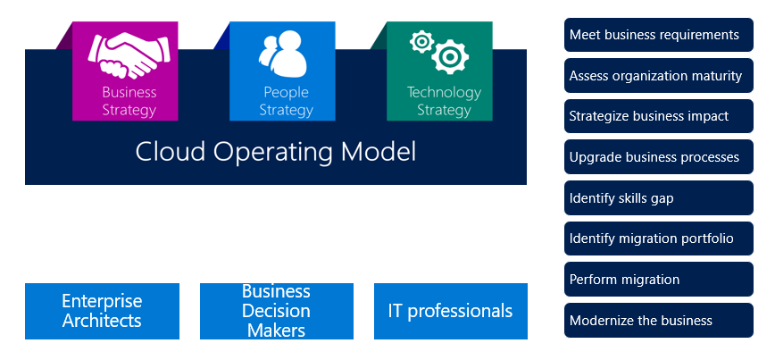
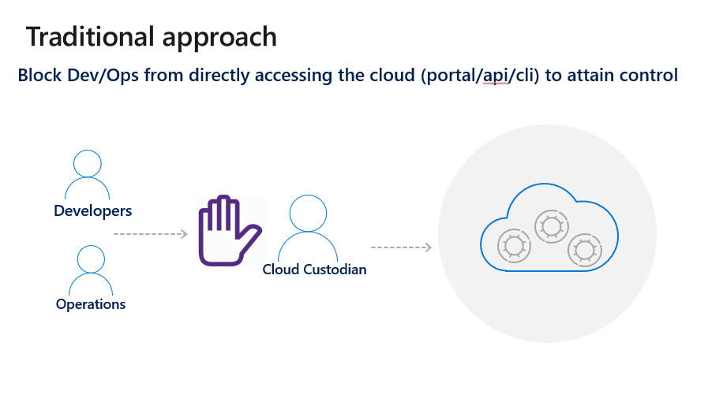
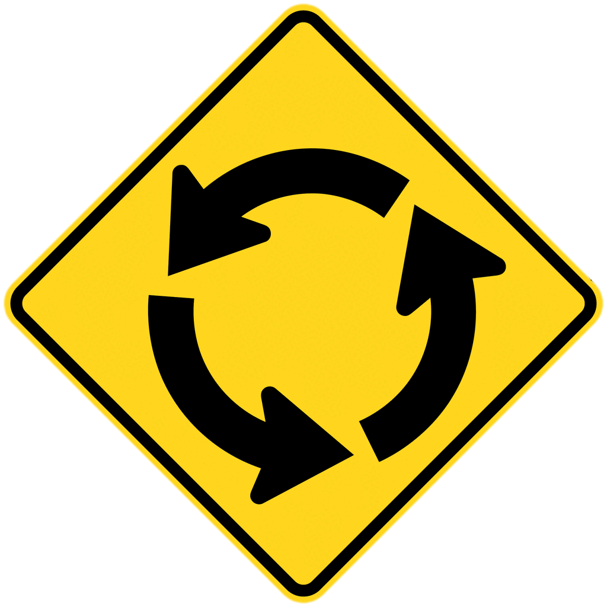
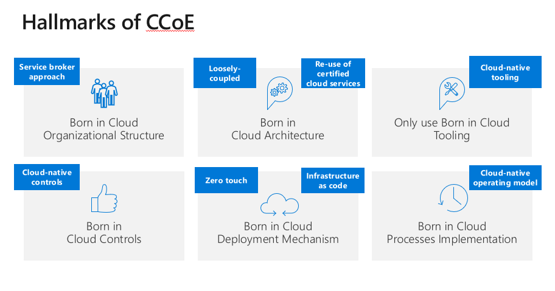
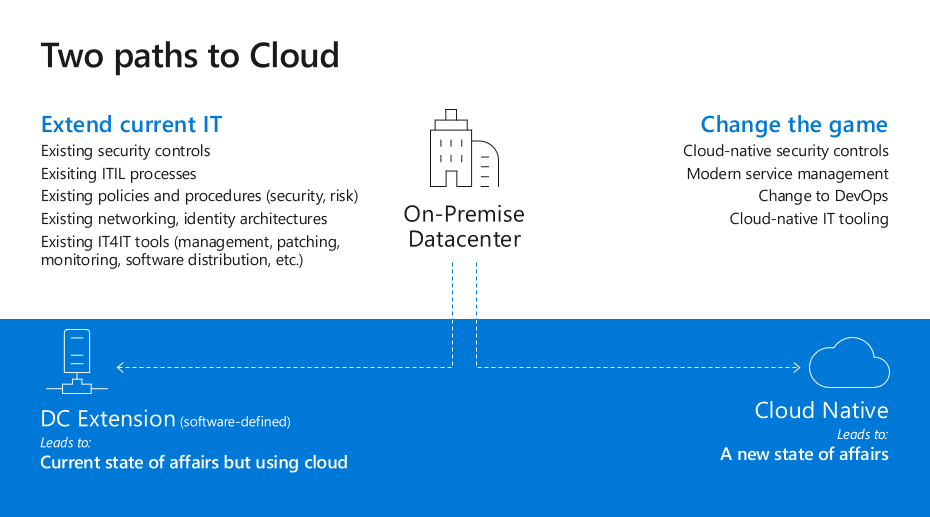
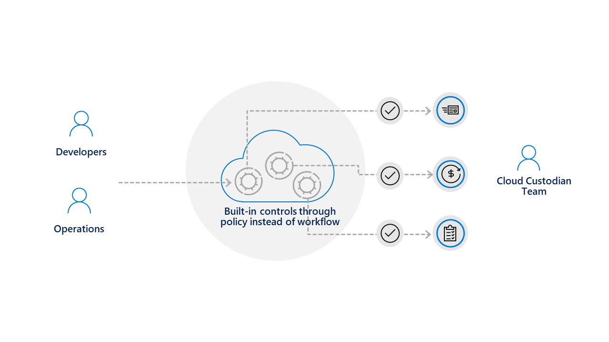
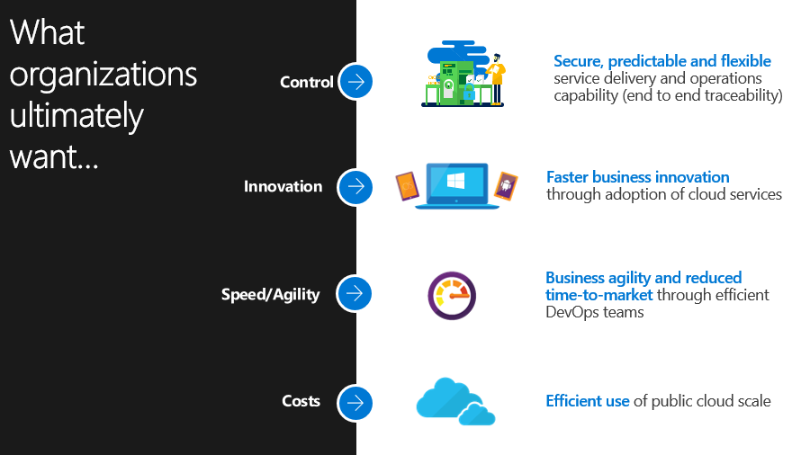
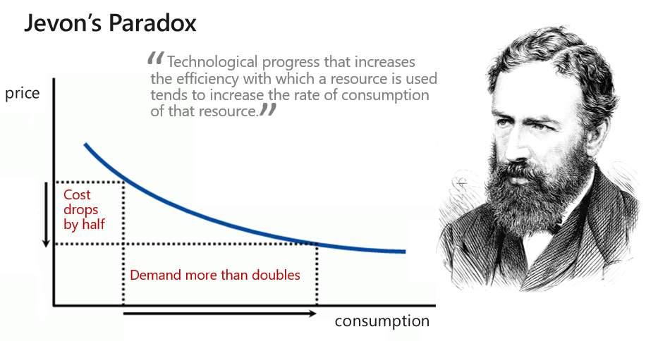

Azure Governance Foundations Introduction
=========================================

Contents:
---------

-   [The need for governance](#the-need-for-governance)

-   [The cloud operating model](#the-cloud-operating-model)

-   [Executive Summary](#executive-summary-of-a-cloud-center-of-excellence)

-   [History](#history)

-   [What is a CoE](#what-is-a-ccoe)

-   [Do I need a CoE?](#do-i-need-a-ccoe)

The need for governance
-----------------------

The characteristics of the public cloud - agility, flexibility, and
consumption-based pricing - are of paramount importance to organizations that
need to move quickly. Historically enterprise IT, while trying to ensure that
systems are effectively governed and secured, were often seen as slow to react
and in the most extreme cases as draconian in their approach.

This gave rise to the notion (in some cases a misconception) that the time and
effort of creating a comprehensive governance system and its accompanying
bureaucracy would slow the business down to the point where it would negate any
gains realized from using the cloud. As such, some groups within businesses
ended up going directly to cloud providers without involving enterprise IT. The
practice was in fact so popular it was given the name “Shadow IT” by the
industry.

When we look at enterprises who have successfully moved to the cloud, we find
that they typically address the topic of governance early to ensure the
effective use of the cloud within the enterprise. They have a general approach
of building and securing their cloud before anyone can use it. A common analogy
used among these organizations is “building the house” before letting anyone
occupy it.

To follow the analogy of a house being built (where a well-governed cloud is the
outcome) we need to make use of scaffolding to secure our structures. The
scaffold provides the general outline and boundaries for future features to be
added. An enterprise cloud scaffold is much the same: a set of flexible controls
and cloud capabilities that provide structure to the environment, sets
perimeters and provides and anchors for services built on the public cloud.
Scaffolding provides a foundation to create and attach new services keeping
speed of delivery in mind.

The enterprise scaffold is intended to be the foundation of cloud environments.
It enables administrators to ensure workloads meet the minimum governance
requirements of an organization while allowing business groups and developers to
quickly meeting their own goals.

Contrary to the opinions that led to the rise of Shadow IT, our experience shows
that foundational governance efforts greatly speed, rather than impede, cloud
growth.

How an enterprise implements this scaffolding and governance varies but the
purpose of the Azure Governance Foundations (AGF) is to provide a concrete
approach to this effort.

One approach that successful customers have implemented is the creation of a
Cloud Center of Excellence (CCoE). The CCoE is comprised of teams of very
specialized personnel who focus on cloud governance and management. The idea of
a CCoE is one of a modern IT operational model that that follows an agile
approach to capturing business requirements to partner with the business. The
goal of the AGF is to help customers create a functional CCoE that provided
agility, governance and security to the business.

The cloud operating model
=========================

Cloud Operating Model (COM) helps organizations with a simplified cloud adoption
journey with Microsoft Azure. It contains detailed information to cover an
end-to-end cloud adoption journey, starting from assessing cloud readiness, to
defining business and technology strategy. It contains a framework to
strategize, plan, migrate, and optimize infrastructure for Microsoft Azure.

If you haven’t yet read this document, it is strongly encouraged you do so now.
The AGF approach is predicated on the COM and understanding the context it
provides is important and valuable.

The COM provides a comprehensive look at how enterprises might plan, migrate,
and optimize infrastructure in the cloud and focuses on these through three
strategy lenses, Business, People and Technology. The lion’s share of the
content is, not surprisingly, focused on the technology strategy. In reading
through the document you may have felt that the topic of people was somewhat
brief (2 pages out of the 69 total pages).

The COM describes the creation of a Cloud Strategy Team (CST) consisting of
business leaders, finance, IT infrastructure, and application groups. These
teams can help with the cloud analysis and experimentation phase.

The Azure Governance Foundations provides guidance for the next phase in that
journey. The AGF is here to answer the questions of “what happens after the
analysis and experimentation are completed? and Where do I go from here?”

Executive Summary of a Cloud Center of Excellence
-------------------------------------------------

The CCoE is an evolution of the traditional, legacy IT model operated on
premises and in customer own datacenters. While the traditional IT model may
have served organizations well, it also had a number of limitations. These
limitations were driven by traditional ITs need both to acquire hardware and to
install any accompanying software. This effort typically created siloed
organizations within IT where each silo managed its own parochial needs. The
introduction of public clouds and in particular, the need for Agile software
development meant that siloed organization such as these created barriers to
developing an efficient public cloud offering.

The CCoE is first and foremost the transformation from IT being an intermediary
for strategy, design and operation (a man-in-the-middle role) to becoming a
partner with the business and adds value as a broker to business providing
knowledge and experience around the evolving technology landscapes that cloud
creates.

The CCoE helps customers build a modern IT organization that follows an agile
approach and follows cloud-native principles like using reusable deployment
packages that align with security, compliance, and service management policies;
and maintaining a functional cloud platform that aligns with operational
procedures. The CCoE utilizes DevOps principles combined with cloud native
service management and security controls to empower IT to deliver products and
services with speed, agility, and control.

Enterprises are increasingly adopting the public cloud for its agility and
flexibility. They utilize the cloud's strengths to generate revenue and optimize
resource usage for the business. Microsoft Azure provides a multitude of
services and capabilities that enterprises assemble like building blocks to
address a wide array of workloads and applications.

History
=======

As mentioned in the introduction, enterprise IT departments, while trying to
ensure that systems are effectively governed and secured, were often seen as
slow to react and in the most extreme cases as draconian in their approach.

Why was the that the case?

Traditionally IT departments were concerned with the infrastructure in their
datacenter. Whether that datacenter was thousands of square feet of raised floor
and rows of racks or just an office (sometimes even a closet) with a mix of
gear. The IT department was responsible for all of it – from purchasing it, to
racking and stacking the equipment, not to mention networking, power, cooling
and of course maintenance and patching. It was a challenging responsibility and
IT departments needed to exact strong control measures on the systems they had
as well as the process for acquiring new systems. Someone had to consider the
footprint, power consumption and other aspects of adding new hardware.

Generally speaking, making changes to existing systems or adding new systems
were a time-consuming effort. Change tickets needed to be created,
authorizations provided, systems updated and ultimately personnel sent to
address the request.

As virtualization software became mainstream this process was simplified
somewhat and generally accounted for an improvement in the time to fulfill
requests. IT departments would tend to overprovision their hypervisor hosts with
more compute and memory than was currently required (rather than rightsizing the
hardware to meet the current request) with the understanding that the business
would grow into that additional capacity. In this way they could use software
defined computing to carve out “virtual machines” from the hardware and
provision them. Likewise, they could also overcommit the hosts they had adding
more virtual machines than should be possible, based on their paper
requirements. This was possible by virtue of the hypervisor software and the
fact that virtual machines rarely used all the resources that they were spec’d
to require.

But even with the improvements brought about by virtualization and software
defined resources (compute, network typically) the process to request a new
virtual machine did not improve commensurate with the technology. Legacy
systems, intrenched processes and a lack of automation in IT service management
continued to plaque many companies.

Enter the world of cloud. The earliest days of the cloud were marked by a
frustration with the speed and service offered by IT departments (a problem that
still persists). Business units would find that the IT departments simply moved
too slowly either in fulfilling requests or in acquiring new hardware. In
frustration they would go directly to cloud providers and sign up for the
services they wanted, getting access to these new systems in just a few minutes
(where IT might take days, weeks or even longer). And so “Shadow IT” was born.

Shadow IT left the enterprise IT with an extremely difficult situation. They
were tasked with keeping the companies systems, networks and data secured but
they might have no knowledge of these Shadow IT systems and if they did know of
them, they might not have access.

Now, as companies began to adopt cloud more broadly and offer cloud services the
need for Shadow IT has diminished to a degree (since the company no longer needs
to acquire hardware to meet business needs). But how would IT manage a cloud
with infinite capacity? A cloud where users might spin up hundreds of machines
accidently or otherwise, was a cloud that presented the IT department with a new
set of problems. Even if they could control the costs, how would they secure the
systems? Assure good governance? Monitor the health of these services?

A common approach is to take the existing model from their on premises data
centers and apply this to the cloud. The IT department asserts control by acting
as a cloud custodian using a man-in-the-middle approach. All request for cloud
resources go through the cloud custodian.

While this approach returns control back to the IT department, it also greatly
reduces the value of the cloud to bring speed and agility to the organization.
The approach works but at the cost of reducing the true potential of the cloud.

A new approach to an old problem
================================

As described above, the perception of IT departments as slow, cumbersome and
sometimes draconian are not baseless but, in fairness, the reasons that these
management practices arose were reasonable reactions to a changing technology
landscape.

Still there has to be a better approach to cloud than stopping everyone who has
a request for cloud services and forcing them through a provisioning process.
The cloud custodian can only manage a fixed number of requests, if the company
requires more cloud resources than the custodian can manage, the requests sit
idle. The longer the requests sit idle the more the requestor might be lured
back into the Shadow IT world.

###### A better approach than stopping every request and manually addressing it would be a system where requests can be self-service but also one where they are automatically provisioned in a manner that meets the corporate governance, security and compliance requirements.

Think of it as a round-about (or traffic circle) where request can come through
and be met safely and without needing to stop. “Guardrails” are in place to
ensure that the requests do not go “off the road”.

In theory this sounds wonderful. No one slows down, and all the corporation’s
requirements are also met. But in practice, this is not a common approach today.
Part of the reason for this is that many of the cloud-native tools that afford
this approach are relatively new. In fact, the entire AGF approach is predicated
on a few technological requirements that the cloud must provide. These are the
mechanisms to enforce policies on new requests and either reject those that
don’t comply or modify the resulting service in such a way that it will be in
compliance. In the case of Azure, these mechanisms are Azure Policies,
Management Groups and Azure Blueprints. Absent these mechanisms, new requests
would need to pass through a dizzying number of scripts (all of which would need
to be created and maintained) in order to enact some similar amount of control.
By taking advance of the controls the cloud natively provides we can govern in a
“cloud first” model with relative ease.

Cloud first, cloud forward
==========================

S

What is a ccoe?
===============

S

A picture containing text, map Description automatically generated

### Do I need a ccoe?

This CCoE offering is where Partners will help customers setup and
operationalize a CCoE with deep focus foundational aspects of platform
enablement. The goal of the offering is to create a secure and well-governed
Azure environment, ready to accept workloads This offering can be undertaken by
almost any customer, from those who are just beginning their cloud journey to
ones who are already deeply invested in cloud but want to modernize their IT
approach.

While the fullest expression of a CCoE may be an organization that implements a
zero touch, infrastructure as code environment - not all customers are willing
nor ready to make the full extent of that journey. This offering is designed to
formalize the creation and to operationalize a CCoE with a focus on platform
aspects, where immediate gains can be made in terms of governance, security and
operational efficiency.

The content of this offering is a pre-requisite before the DevOps-focused CCoE
efforts can begin. An offering focused on CCoE Dev-Ops can be added after this
one for those customers who would benefit from it. One of the tenants of this
offering is to create a CCoE in a way that minimized architectural and
organizational debt for those customers who continue on to take the full
journey.

This model provides a structure for customers to implement, manage, and operate
their Azure platform. The CCoE uses agile DevOps principles combined with
cloud-native service management and security controls to help drive business
innovation, increase agility, and reduce time to value within a secure,
predictable and flexible services delivery and operations management capability.
The CCoE provides patterns for modern IT structures, actions and governance.

This offering is meant to provide the coaching and mentorship needed to enable
the customer’s IT team to realize the value of CCoE operations, as well as
making IT an integral part of their organization.

The CCoE will be initially populated by both the Partner and customer resources
(customer permitting). The Partner will bring recommended practices and
experience to bear with customers to build the CCoE in order to implement,
manage, and operate the Azure platform.

Once the CCoE has grown and matured the need for external guidance is be reduced
and the customer alone should populate the CCoE. This offering is a hands-on
approach where the customer achieves cultural change, adopt a new way of working
and embed use of cloud-native technology and principles.

S

Agile
=====

S
