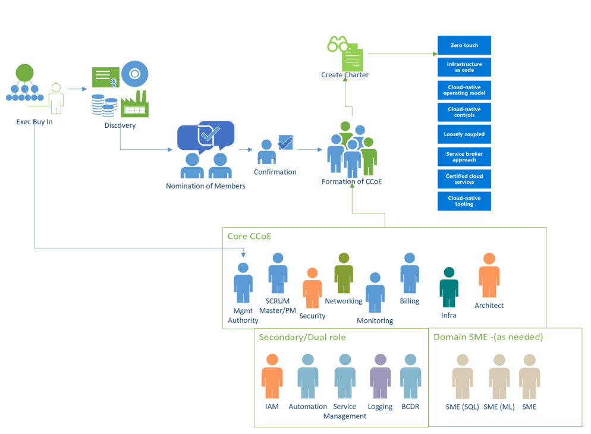
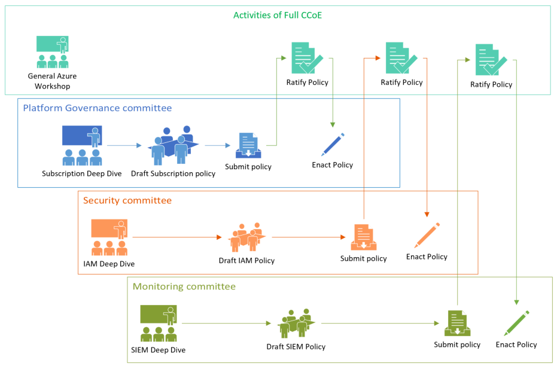
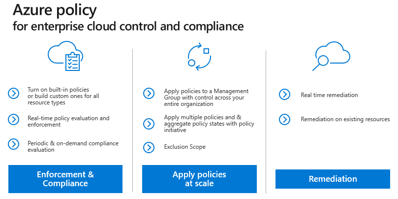
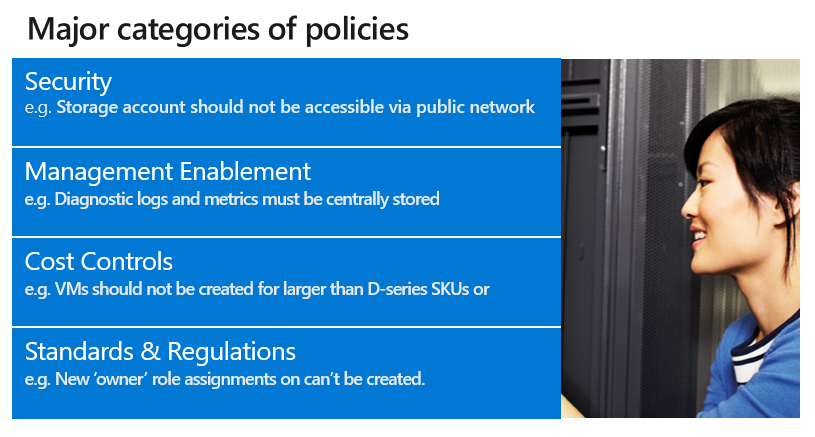

Building a Cloud Center of Excellence
=====================================

Contents:
---------

-   [Executive sponsorship](#executive-sponsorship)

-   [General approach](#general-approach)

-   [Membership](#membership)

-   [Commitment and expectations](#commitment-and-expectations)

-   [Charter](#charter)

-   [Committee interaction](#committee-interaction)

-   [Azure Policy](#azure-policy)

-   [Training and Education](#training-and-education)

Customizing this approach
-------------------------

This document describes the formation, approach and interaction of a CCoE. This
guidance should be thought of as a generic proposal and not a one-size-fits-all
design. The size of your organization and how it is structured should be taken
into account when creating your CCoE. Feel free to customize this approach as
needed. Instead of six committees you may find that breaking up the Security
Committee into separate groups for Identity and Networking makes more sense in
your organization - or you may find that the Automation and Product Catalog
Committees should be merged. These are perfectly acceptable if the approach you
take produces the desired results. The details listed here is available for
those organizations looking for a place to start.

Executive sponsorship
---------------------

Before you undertake the AGF or the formation of a CCoE is it imperative that
you have an executive sponsor. This approach is forward-looking and disruptive
to the way IT organizations have been run historically. You should expect to
encounter resistance, either to cloud in general or this approach in particular
(typically arguing instead for the “Extend the DC” model described in the [AGF
Introduction](https://github.com/gosson/azure-governance-foundations/blob/master/AGF/100-AGF%20Introduction.md)).
Ideally your sponsor should be a C-level executive (CIO, CTO, etc.) and one who
shares the vision of modernizing IT and evolving it from a technology broker to
a business partner. Again, depending on the size and complexity of your
organization, this may not be feasible but secure a sponsor with as much power
and authority as possible. Their endorsement will facilitate the creation of
these groups and provide a mantel of authority under which they will operate.

Once your sponsor has been identified, they should nominate someone to head the
CCoE (as they will probably not have the time to do this themselves). This
person will be charged with the actual creation of the groups, nomination of
membership and general day-today activities. They will also bring the sponsor in
when organizational roadblocks occur at least until such a time as the charter,
direction and endorsement of the CCoE is widely understood within the
organization.

General approach
----------------

At its core, the CCoE can be thought of as a parliamentary system with multiple
assemblies (technically a multicameral governing body) in which each assembly
(or committee) represents an aspect of the technology transformation: Platform,
Security, Monitoring, etc. and is responsible for governing that aspect. The
committees control their own destiny with respect to their areas but require
consensus on matters that affect other committees for the CCoE as whole. A
committee brings their proposal to the full CCoE to be discussed and ultimately
ratified. If during this discussion, it becomes clear that the policy will
affect other committees, the affected committees should come to an agreement. If
they cannot, the full CCoE may vote on such matters.

Below are a few examples to help clarify this approach:

#### Example 1: 

The Monitoring committee submits a policy where every new container that is
deployed must have logging enabled and be configured to send those logs to a
specified workspace so that it can be viewed by Azure Monitor. During
discussion, a representative from the Architecture asks if the current
architecture design for Azure Kubernetes Service needs to be modified to
accommodate this change. The Monitoring committee explains that the policy will
automatically be applied to new containers without any changes to the design and
that existing containers can be updated with a simple script generated by the
policy engine. The Architecture team having been satisfied that they are
unaffected has no objection to the policy.

Because this policy does not affect other committees, the details of the policy
(what amount of logging and where the log go) are solely the purview of the
Monitoring Committee. Nonetheless it is important to submit the policy for
ratification so that the CCoE understands what the policy does and has a chance
to ask questions about it.

#### Example 2: 

The Platform committee decides that having a large number of Azure subscriptions
(one for each application) is desirable. When the Platform committee brings that
policy to the full CCoE to be discussed, the Security committee raises a
technical consideration – namely that the current Azure limitation for vnet
peerings is 100. If the organization will have more than 100 subscriptions,
connectivity between subscriptions will need to be addressed differently that
they had planned. Since this policy does affect more than one committee the
committees need to find an amicable resolution or have the entire CCoE vote on
the policy.

In this case during discussion the CCoE determines that there are only 20
applications currently in the plan and that at the rate of growth is will be at
least three years until the organization reaches 100 applications. Given the
expected timeframe the Networking committee withdraws its objection with the
expectation that the technical limit (which has grown over time) is likely to
continue to grow and meet their needs.

If the Networking committee had not withdrawn its objection and was unable to
reach a consensus with the Platform Committee, the CCoE would then vote of the
matter with each member weighing the merits and risks of the policy.

Membership
----------

The CCoE, as a whole, is composed of the person nominated by the executive
sponsor (Mgmt Authority in the diagram below), a SCRUM master or program manager
and a representative from each committee.

Each committee must contain at least one member (but generally not more than
six). Some committees can share memberships where appropriate. For example, a
member of the Security committee would also be at home as a member of the
product Catalog committee (since the certification of products in the catalog
has a security element). This might also be a necessity if the number or
resources that can be dedicated to CCoE work is minimal

There should also be at least one project manager (or SCRUM manager) for each
committee as well as the CCoE. The same PM can manage the responsibility across
multiple committees if time/resourcing permits. In larger organizations the
creation of a Project Management Committee would not be out of place.

Commitment and expectations
---------------------------

\<Content needed\>

Charter
-------

\<Content needed\>

A CCoE will create its own specific charter that will dictate how it operates in
specific but in general terms there are a few common hallmarks of a CCoE model:

-   Service Broker Approach

-   Loosely Coupled Architectures

-   Re-use of certified cloud services

-   Use of Cloud-native tooling

-   Cloud Native Controls

-   Zero touch implementations

-   Infrastructure as code

A cloud native operating model

Committee interaction
---------------------

The CCoE should operate in such a way that committees are empowered to determine
appropriate policies for themselves. Once these policies have been identified by
a committee, they should be raised to the CCoE to be ratified. While each
committee should determine their own destiny, as it relates to their own
governance and business needs, the complexity of cloud requires a wide exposure
to the CCoE to ensure that the recommendations of the committee do not cause
unintended consequences or affect other committees’ policies.

Once policies are ratified by the CCoE they will be implemented by the
recommending committee or the Platform committee, typically in the form of Azure
Policies or Azure Blueprints.

Azure Policy
------------

\<Content needed\>

Training and Education
----------------------

Please refer to the [Enterprise Learning
Plan](https://github.com/gosson/azure-governance-foundations/blob/master/AGF/102-Enterprise-Learning-Plan.md)
for a detailed sample of the courses, workshop and hacks that are available to
upskill the members of the CCoE. This training document is broken down by
committee.

Where do I go from here?
------------------------

Governance is crucial to the success of Azure. This article targets the
technical implementation of an enterprise scaffold but only touches on the
broader process and relationships between the components. Policy governance
flows from the top down and is determined by what the business wants to achieve.
Naturally, the creation of a governance model for Azure includes representatives
from IT, but more importantly it should have strong representation from business
group leaders, and security and risk management. In the end, an enterprise
scaffold is about mitigating business risk to facilitate an organization's
mission and objectives

Now that you have learned about subscription governance, it's time to see these
recommendations in practice. See [Examples of implementing Azure subscription
governance](https://github.com/rdendtler/architecture-center/blob/eca/scaffold-v2/docs/cloud-adoption/appendix/azure-scaffold-examples.md).
