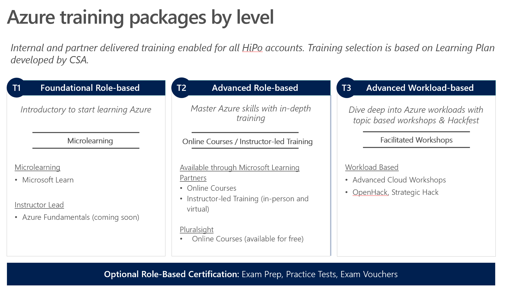

Enterprise Learning Plan
========================

Contents:
---------

-   Assessment and Gap Analysis 1

-   Skill Requirements 1

-   Recommended Learning Plans 2

-   Foundational (T1) 2

-   Advanced Role-based (T2) 3

-   Advanced Workload-based (T3) 4

-   Customer Training Plan and Schedule 4

-   Role Definitions 5

Assessment and Gap Analysis
---------------------------

The CCoE requires people, processes, and technology with the capabilities needed
for the scope of this offering. Before committees can operate effectively, they
must become subject matter experts in the Azure offerings that relate to the
committee’s purview. The Partner will work with the customer to assess the skill
level of the members of committees as well as the customer’s current Azure
environment. While the Partner may act as a committee member in these groups it
is of paramount importance that the customer be knowledgeable of the appropriate
Azure offerings and act as their own agents in creating policies.

Any training or workshops required to bring committee members up to the
appropriate level of expertise will be included in the scope of work from the
Partner. The level of effort necessary to bring the customer and their
environment up to the needed functionality to support CCoE will be determined
and added to offering by the Partner. These workshops can generally be delivered
in parallel if needed in the interest of time since most of the topics will not
include members of other committees.

Skill Requirements
------------------

Describe the skills required to meet the business goals.

In order to accomplish their business goals, XYZ has a need to help ramp up
specific skills in Application Modernization (Containers, Functions, API
Management, Application Insights) along with some Cloud Infrastructure
Fundamentals (Compute, Storage, Networking, Backup, Monitoring) for staff that
have not yet had the opportunity to work with Azure. They plan to train 100
people total in different cities: Hong Kong, Tokyo and Shanghai.

 Recommended Learning Plans
---------------------------

*Training Menu*

The training menu is divided into three tiers of training packages:
Foundational, Advanced Role-Based, and Advanced Workload-Based.

Tier 1 offers an introductory start to Azure with self-paced and instructor-led
options.

Tier 2 provides master Azure skills within more in-depth training with
self-paced MOOC and instructor-led options.

Tier 3 provides instructor-led and facilitated training for a deep dive into
Azure workloads with topic-based workshops and Hacks.

Both T2 and T3 are considered advanced level content.

Foundational (T1)
-----------------

>   *Introductory start to learning Azure. Available as Self-Paced (online) or
>   Instructor Led.*

**1. Microsoft Learn -**
[www.microsoft.com/learn](http://www.microsoft.com/learn)

-   Step-by-Step Learning

    -   Guided microlearning by product/service, difficulty, job role, etc

    -   Videos, tutorials, and hands-on learning

    -   Role-based learning paths to prepare for certification

-   Gamification & Achievements

    -   Unlock achievements

    -   Task-based achievements to reward your hands-on skills

    -   Customizable user profile

-   Friction-free Learning

-   All learning content is free

    -   Free trial accounts to easily test-drive products and services

    -   Content available in the spoken language and programming language of my
        choice

    -   No-install, browser-based Interactive coding/scripting environments

    -   All scripts and code samples available for download

**2. Instructor-led –** Azure Fundamentals (coming soon)

Advanced Role-based (T2)
------------------------

>   *Master Azure skills with in-depth role-based training that is aligned to
>   certification.*

1.  **Available through Microsoft Learning Partners**

-   Online courses (available for free)

-   Instructor-led Training (in-person and free)

1.  **Pluralsight - Learning path to Azure certification **

-   Online Courses (available for free)

-   Online self-paced courses that provide a clear path to role-based
    certification, delivered free in partnership with Pluralsight. 

-   Courses cover skills for 3 role-based certifications:

    -   [Azure
        Administrator](https://www.pluralsight.com/role-iq/microsoft-azure-administrator?aid=7010a000001xDURAA2)

    -   [Azure Solution
        Architect](https://www.pluralsight.com/role-iq/microsoft-azure-solution-architect?aid=7010a000001xDURAA2)

    -   [Azure
        Developer](https://www.pluralsight.com/role-iq/microsoft-azure-developer?aid=7010a000001xDURAA2)

-   Over 130 courses available by December 2018

-   Courses in English, translated sub-titles via closed caption

Advanced Workload-based (T3)
----------------------------

>   *Deep dive into Azure workloads with topic-based workshops and Hack*s.

>   **1. Scenario-Based Workshops – “Microsoft Cloud Workshops” – Customer-ready
>   content from the Intelligent Cloud Architect Boot Camp to host your own
>   event with customers and/or partners**

-   Available on GitHub - <https://github.com/Microsoft/MCW>

-   1 day focused around a specific Azure sales scenario: technical skills
    development via architectural solution design and/or hackathon.

-   Extensive catalog with several foundational workshops both corp developed
    and field nominated

-   Use customer-ready Whiteboard Design and Hackathon content from the Cloud
    Boot Camp, as nominated by the WW Tech Sales Leads

>   **2. CSE OpenHack, Strategic Hack - Large-scale coding engagement focused on
>   the development and knowledge transfer of strategic tech skills to both MSFT
>   (CSA, TSP, GBB) and industry (customer, partner, developer) tech roles
>   through challenge-based hack.**

-   OpenHack details:
    [aka.ms/CSEOpenHackRegister](https://aka.ms/CSEOpenHackRegister)

-   Project Hacks with CSE – 5 days

-   “Code with” Hackathons focused on a specific customer project

-   Identifiable outcomes and workloads customer can deploy on Azure

-   Available through Open Hacks, Multi Customer Hacks, & 1:1

Customer Training Plan and Schedule
-----------------------------------

| **Targeted Role(s)**                                       | **\# to be trained** | **Title of Training**               | **Level**                 | **Delivery Approach**                               | **Length** | **Scheduled Date**           |
|------------------------------------------------------------|----------------------|-------------------------------------|---------------------------|-----------------------------------------------------|------------|------------------------------|
| **Foundational Training**                                  |                      |                                     |                           |                                                     |            |                              |
| *SAMPLE: Business Decision Makers and Project Managers*    | *100*                | *Azure Essentials*                  | *Foundational*            | *In-person, Learning Partner*                       | *varies*   | *June 4th (ongoing monthly)* |
|                                                            |                      |                                     |                           |                                                     |            |                              |
|                                                            |                      |                                     |                           |                                                     |            |                              |
| **Role-Based Training**                                    |                      |                                     |                           |                                                     |            |                              |
| *SAMPLE: System Administrators, Architects, and Engineers* | *20*                 | *Implementing Azure Infrastructure* | *Role-based Advanced*     | *ILT at customer*                                   | *5 days*   | *July 2nd-3rd*               |
|                                                            |                      |                                     |                           |                                                     |            |                              |
|                                                            |                      |                                     |                           |                                                     |            |                              |
| **Workload-Based Training**                                |                      |                                     |                           |                                                     |            |                              |
| *SAMPLE: Architects, and Developers*                       | *15*                 | *\<\<Specific Workshop titles\>\>*  | *Workload-based Advanced* | *Two Workshops with Hands-on Labs at customer site* | *2 days*   | *Xx - xx*                    |
|                                                            |                      |                                     |                           |                                                     |            |                              |
|                                                            |                      |                                     |                           |                                                     |            |                              |

3.1 Role Definitions
--------------------

-   Azure Administrator-

    -   manage cloud services that span storage, security, networking, and
        compute cloud capabilities

    -   deep understanding of each service across the full IT lifecycle

    -   take requests for infrastructure services, applications, and
        environments

    -   make recommendations on services to use for optimal performance and
        scale, as well as provision, size, monitor, and adjust resources as
        appropriate 

    -   have proficiency in using PowerShell and the Command Line Interface

    -   basic familiarity or knowledge of Azure Portal, ARM templates, operating
        systems, virtualization, cloud infrastructure, storage structures, and
        networking

-   Azure Developer

    -   design and build cloud solutions such as applications and services

    -   participate in all phases of development, from solution design, to
        development and deployment, to testing and maintenance

    -   partner with cloud solution architects, cloud DBAs, cloud
        administrators, and clients to implement the solution

    -   proficient in developing apps and services by using Azure tools and
        technologies, including storage, security, compute, and communications 

    -   have at least one year of experience developing scalable solutions
        through all phases of software development and be skilled in at least
        one cloud-supported programming language

-   Azure Solutions Architect

    -   advises stakeholders and translates business requirements into secure,
        scalable, and reliable solutions  

    -   have advanced experience and knowledge across various aspects of IT
        operations, including networking, virtualization, identity, security,
        business continuity, disaster recovery, data management, budgeting, and
        governance

    -   manages how decisions in each area affects an overall solution  

    -   proficient in Azure administration, Azure development, and DevOps, and
        have expert-level skills in at least one of those domains 
