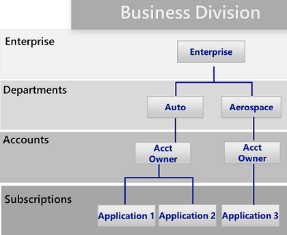

Platform Governance Comittee
============================

Azure enterprise scaffold: Prescriptive subscription governance
===============================================================

[!NOTE] Microsoft has released into preview a new capability called [Azure
Blueprints](https://github.com/rdendtler/architecture-center/blob/eca/scaffold-v2/azure/governance/blueprints/overview)
that will enable you to package, manage, and deploy common images, templates,
policies, and scripts across subscriptions and management groups. This
capability is the bridge between the scaffold's purpose as reference model and
deploying that model to your organization.

The following image shows the components of the scaffold. The foundation relies
on a solid plan for the management hierarchy and subscriptions. The pillars
consist of Resource Manager policies and strong naming standards. The rest of
the scaffold are core Azure capabilities and features that enable and connect a
secure and manageable environment.

enterprise scaffold

enterprise scaffold

enterprise scaffold

enterprise scaffold

enterprise scaffold

enterprise scaffold

Define your hierarchy
---------------------

The foundation of the scaffold is the hierarchy and relationship of the Azure
Enterprise Enrollment through to subscriptions and resource groups. The
enterprise enrollment defines the shape and use of Azure services within your
company from a contractual point of view. Within the enterprise agreement, you
can further subdivide the environment into departments, accounts, and finally,
subscriptions and resource groups to match your organization's structure.

hierarchy

hierarchy

hierarchy

hierarchy

hierarchy

hierarchy

An Azure subscription is the basic unit where all resources are contained. It
also defines several limits within Azure, such as number of cores, virtual
networks and other resources. Azure Resource Groups are used to further refine
the subscription model and enable a more natural grouping of resources.

Every enterprise is different and the hierarchy in the above image allows for
significant flexibility in how Azure is organized within your company. Modeling
your hierarchy to reflect the needs of your company for billing, resource
management, and resource access is the first — and most important — decision you
make when starting in the public cloud.

Departments and Accounts
------------------------

The three common patterns for Azure Enrollments are:

-   The **functional** pattern

>   functional

-   The **business unit** pattern

>   business

-   The **geographic** pattern

>   geographic

Though each of these patterns has its place, the **business unit** pattern is
increasingly being adopted for its flexibility in modeling an organization's
cost model as well as reflecting span of control. Microsoft Core Engineering and
Operations group has created a sub-set of the **business unit** pattern that is
very effective, modeled on **Federal**, **State**, and **Local**. (For more
information, see [Organizing subscriptions and resource groups within the
Enterprise](https://azure.microsoft.com/blog/organizing-subscriptions-and-resource-groups-within-the-enterprise/).)

Management Groups
-----------------

Microsoft has recently released a new way of modeling your hierarchy: [Azure
management
groups](https://github.com/rdendtler/architecture-center/blob/eca/scaffold-v2/azure/azure-resource-manager/management-groups-overview).
Management groups are much more flexible than departments and accounts and can
be nested up to six levels. Management groups allow you to create a hierarchy
that is separate from your billing hierarchy, solely for efficient management of
resources. Management groups can mirror your billing hierarchy and often
enterprises start that way. However, the power of management groups is when you
use them to model your organization where related subscriptions — regardless
where they are in the billing hierarchy — are grouped together and need common
roles assigned as well as policies and initiatives. A few examples:

-   **Production/Non-Production**. Some enterprises create management groups to
    identify their production and non-production subscriptions. Management
    groups allow these customers to more easily manage roles and policies, for
    example: non-production subscription may allow developers "contributor"
    access, but in production, they have only "reader" access.

-   **Internal Services/External Services**. Much like
    Production/Non-Production, enterprises often have different requirements,
    policies and roles for internal services vs external (customer facing)
    services.

Well thought out management groups are, along with Azure Policy and Initiatives
the backbone of efficient governance of Azure.

Subscriptions
-------------

When deciding on your Departments and Accounts (or management groups), you are
primarily looking at how you're dividing up your Azure environment to match your
organization. Subscriptions, however, are where the real work happens and your
decisions here impact security, scalability and billing. Many organizations look
at the following patterns as their guides:

-   **Application/Service**: Subscriptions represent an application or a service
    (portfolio of applications)

-   **Lifecycle**: Subscriptions represent a lifecycle of a service, such as
    Production or Development.

-   **Department**: Subscriptions represent departments in the organization.

The first two patterns are the most commonly used, and both are highly
recommended. The Lifecycle approach is appropriate for most organizations. In
this case, the general recommendation is to use two base subscriptions.
"Production" and "Non-Production," and then use resource groups to break out the
environments further.

Resource groups
---------------

Azure Resource Manager enables you to put resources into meaningful groups for
management, billing, or natural affinity. Resource groups are containers of
resources that have a common life cycle or share an attribute such as "all SQL
servers" or "Application A".

Resource groups can't be nested, and resources can only belong to one resource
group. Some actions can act on all resources in a resource group. For example,
deleting a resource group removes all resources within the resource group. Like
subscriptions, there are common patterns when creating resource groups and will
vary from "Traditional IT" workloads to "Agile IT" workloads:

-   "Traditional IT" workloads are most commonly grouped by items within the
    same life cycle, such as an application. Grouping by application allows for
    individual application management.

-   "Agile IT" workloads tend to focus on external customer-facing cloud
    applications. The resource groups often reflect the layers of deployment
    (such as Web Tier, App Tier) and management.

[!NOTE] Understanding your workload helps you develop a resource group strategy.
These patterns can be mixed and matched. For example, a shared services resource
group in the same subscription as "Agile" resource groups.

Naming standards
----------------

The first pillar of the scaffold is a consistent naming standard. Well-designed
naming standards enable you to identify resources in the portal, on a bill, and
within scripts. You likely already have existing naming standards for
on-premises infrastructure. When adding Azure to your environment, you should
extend those naming standards to your Azure resources.

[!TIP] For naming conventions:

-   Review and adopt where possible the [Patterns and Practices
    guidance](https://docs.microsoft.com/en-us/azure/architecture/best-practices/naming-conventions).
    This guidance helps you decide on a meaningful naming standard and provides
    extensive examples.

-   Using Resource Manager Policies to help enforce naming standards

Remember that it's difficult to change names later, so a few minutes now will
save you trouble later.

Concentrate your naming standards on those resources that are more commonly used
and searched for. For example, all resource groups should follow a strong
standard for clarity.

Resource Tags
-------------

Resource tags are tightly aligned with naming standards. As resources are added
to subscriptions, it becomes increasingly important to logically categorize them
for billing, management, and operational purposes. For more information, see
[Use tags to organize your Azure
Resource](https://docs.microsoft.com/en-us/azure/azure-resource-manager/resource-group-using-tags).

[!IMPORTANT] Tags can contain personal information and may fall under the
regulations of GDPR. Plan for management of your tags carefully. If you're
looking for general info about GDPR, see the GDPR section of the [Service Trust
Portal](https://servicetrust.microsoft.com/ViewPage/GDPRGetStarted).

Tags are used in many ways beyond billing and management. They are often used as
part of automation (see later section). This can cause conflicts if not
considered up front. The recommended practice is to identify all the common tags
at the enterprise level (such as ApplicationOwner, CostCenter) and apply them
consistently when deploying resources using automation.

Azure Policy and Initiatives
----------------------------

The second pillar of the scaffold involves using [Azure Policy and
Initiatives](https://github.com/rdendtler/architecture-center/blob/eca/scaffold-v2/azure/azure-policy/azure-policy-introduction)
to manage risk by enforcing rules (with effects) over the resources and services
in your subscriptions. Azure Initiatives are collections of policies that are
designed to achieve a single goal. Azure policy and initiatives are then
assigned to a resource scope to begin enforcement of the particular policies.\<
IMG of Initiatives/Policies/Assignments\>

Azure Policy and Initiatives are even more powerful when used with the
management groups mentioned earlier. Management groups enable the assignment of
an initiative or policy to an entire set of subscriptions.

Common uses of Resource Manager policies
----------------------------------------

Azure policies and initiatives are a powerful tool in the Azure toolkit.
Policies allow companies to provide controls for "Traditional IT" workloads that
enable the stability that is needed for LOB applications while also allowing
"Agile" workloads; such as, developing customer applications without opening up
the enterprise to additional risk. The most common patterns we see for policies
are:

-   **Geo-compliance/data sovereignty**. Azure has an ever-growing list of
    regions across the world. Enterprises often need to ensure that resources in
    a particular scope remain in a geographic region to address regulatory
    requirements.

-   **Avoid exposing servers publicly**. Azure policy can prohibit the
    deployment of certain resources types. A common use is to create a policy to
    deny the creation of a public IP within a particular scope, avoiding
    un-intended exposure of a server to the internet.

-   **Cost Management and Metadata**. Resource tags are often used to add
    important billing data to resources and resource groups such as CostCenter,
    Owner and more. These tags are invaluable for accurate billing and
    management of resources. Policies can enforce the application of resources
    tags to all deployed resource, making it easier to manage.

Common uses of initiatives
--------------------------

The introduction of initiatives provided enterprises a way to group logical
policies together and track as a whole. Initiatives further support the
enterprise to address the needs of both "agile" and "traditional" workloads. We
have seen very creative uses of initiatives, but commonly we see:

-   **Enable monitoring in Azure Security Center**. This is a default initiative
    in the Azure Policy and an excellent example of what initiative are. It
    enables policies that identify un-encrypted SQL databases, VM
    vulnerabilities and more common security related needs.

-   **Regulatory specific initiative**. Enterprises often group policies common
    to a regulatory requirement (such as HIPAA) so that controls and compliancy
    to those controls are tracked efficiently.

-   **Resource Types & SKUs**. Creating an initiative that restricts the types
    of resources that can be deployed as well as the SKUs that can be deployed
    can help to control costs and ensure your organization is only deploying
    resources that your team have the skillset and procedures to support.

[!TIP] We recommend you always use initiative definitions instead of policy
definitions. After assigning an initiative to a scope, such as subscription or
management group, you can easily add another policy to the initiative without
having to change any assignments. This makes understanding what is applied and
tracking compliance far easier.

### Policy and Initiative assignments

After the creation of policies and grouping them into logical initiatives you
must assign the policy to a scope, whether it is a management group, a
subscription or even a resource group. Assignments allow you to also exclude a
sub-scope from the assignment of a policy. For example, if you deny the creation
of public IPs within a subscription, you could create an assignment with an
exclusion for a resource group connected to your protected DMZ.

You will find several Policy examples that show how Policy and Initiatives can
be applied to various resources within Azure on this
[GitHub](https://https:/github.com/Azure/azure-policy) repository.

Cost management
---------------

One of the major changes that you will face when you move from on-premises cloud
to the public cloud is the switch from capital expenditure (buying hardware) to
operating expenditure (paying for service as you use it). This switch from CAPEX
to OPEX also brings the need to more carefully manage your costs. The benefit of
the cloud is that you can fundamentally and positively impact the cost of a
service you use by merely turning it off (or resizing) when it's not needed.
Deliberately managing your costs in the cloud is a recommended practice and one
that mature customers do daily.

Microsoft provides a several tools for you to be able to visual, track and
manage your costs. We also provide a full set of APIs to enable you to customize
and integrate cost management into your own tools and dashboards. These tools
are loosely grouped into: Azure Portal Capabilities and external capabilities

Azure Portal capabilities
-------------------------

These are tools to provide you instant information on cost as well as the
ability to take actions

-   **Subscription Resource Cost**: Located in The Portal, the [Azure Cost
    Analysis](https://github.com/rdendtler/architecture-center/blob/eca/scaffold-v2/azure/cost-management/overview)
    view provides a quick look at your costs and information on daily spend by
    resource or resource group.

-   **Azure Cost Management**: This product is the result of the purchase of
    Cloudyn by Microsoft and allows you to manage and analyze your Azure spend
    as well what you spend on other Public Cloud providers. There are both free
    and paid tiers, with a great wealth of capabilities as seen in the
    [overview](https://github.com/rdendtler/architecture-center/blob/eca/scaffold-v2/azure/cost-management/overview).

-   **Azure Budgets and Action Groups** Knowing what somethings costs and doing
    something about it until recently has been more of a manual exercise. With
    the introduction of Azure Budgets and its APIs, it's now possible to create
    actions (as seen in
    [this](https://channel9.msdn.com/Shows/Azure-Friday/Managing-costs-with-the-Azure-Budgets-API-and-Action-Groups)
    example) when costs hit a threshold. For example, shutting down a "test"
    resource group when it hits 100% of its budget, or [another example].

-   **Azure Advisor** Knowing what something costs is only half the battle; the
    other half is knowing what to do with that information. [Azure
    Advisor](https://github.com/rdendtler/architecture-center/blob/eca/scaffold-v2/azure/advisor/advisor-overview)
    provides you recommendations on actions to take to save money, improve
    reliability or even increase security.

External cost management tools
------------------------------

-   **PowerBI Azure Consumption Insights**. Do you want to create your own
    visualizations for your organization? If so, then the Azure Consumption
    Insights content pack for PowerBI is your tool of choice. Using this content
    pack and PowerBI you can create custom visualizations to represent your
    organization, do deeper analysis on costs and add in other data sources for
    further enrichment.

-   **Consumption API**. The [consumption
    APIs](https://github.com/rdendtler/architecture-center/blob/eca/scaffold-v2/rest/api/consumption)
    give you programmatic access to cost and usage data in addition to
    information on budgets, reserved instances and marketplace charges. These
    APIs are accessible only for Enterprise Enrollments and some Web Direct
    subscriptions however they give you the ability to integrate your cost data
    into your own tools and data warehouses. You can also access these APIs by
    using the Azure CLI, seen
    [here](https://github.com/rdendtler/architecture-center/blob/eca/scaffold-v2/cli/azure/consumption?view=azure-cli-latest).

When we look across customers who have used the cloud for a long time and are
"mature" in their use, we see a number of highly recommended practices

-   **Actively monitor costs**. Organizations that are mature Azure users
    constantly monitor costs and take actions when needed. Some organizations
    even dedicate people to do analysis and suggest changes to usage, and these
    people more than pay for themselves the first time they find an unused
    HDInsight cluster that's been running for months.

-   **Use Reserved Instances**. Another key tenant for managing costs in the
    cloud is to use the right tool for the job. If you have an IaaS VM that must
    stay on 24x7, then using a Reserved Instance will save you significant
    money. Finding the right balance between automating the shutdown of VMs and
    using RIs takes experience and analysis.

-   **Use automation effectively**: Many workloads do not need to be running
    every day. Even turning off a VM for a 4-hour period every day can save you
    15% of your cost. Automation will pay for itself quickly.

-   **Use resource tags for visibility**: As mentioned elsewhere in this
    document, using resource tags will allow for better analysis of costs.

Cost management is a discipline that is core to the effective and efficient
running of a public cloud. Enterprises that achieve success will be able to
control their costs and match them to their actual demand as opposed to
overbuying and hoping demand comes.
