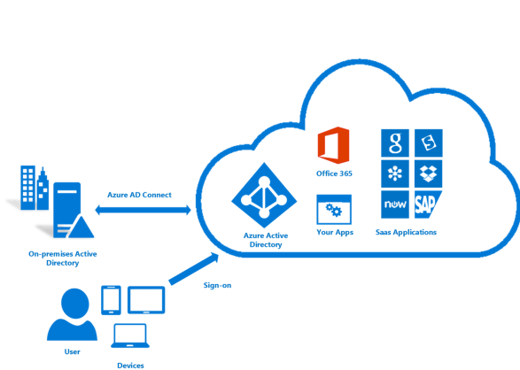
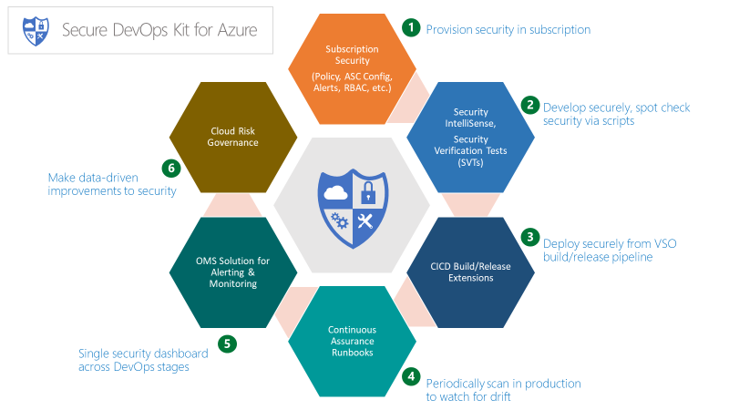

Security Comittee
=================

Identity and access management
------------------------------

One of the first, and most crucial, questions you ask yourself when starting
with the public cloud is "who should have access to resources?" and "how do I
control this access?" Allowing or disallowing access to the Azure portal, and
controlling access to resources in the portal is critical to the long term
success and safety of your assets in the cloud.

To accomplish the task of securing access to your resources you will first
configure your identity provider and then configure Roles and access. Azure
Active Directory (Azure AD), connected to your on-premises Active Directory, is
the foundation of Azure Identity. That said, Azure AD is *not* Active Directory
and it's important to understand what an Azure AD tenant is and how it relates
to your Azure enrollment. Review the available
[information](https://github.com/rdendtler/architecture-center/blob/eca/scaffold-v2/docs/cloud-adoption/getting-started/azure-resource-access.md)
to gain a solid foundation on Azure AD and AD. To connect and synchronize your
Active Directory to Azure AD, install and configure the [AD Connect
tool](https://github.com/rdendtler/architecture-center/blob/eca/scaffold-v2/azure/active-directory/connect/active-directory-aadconnect)
on-premises.

arch.png

arch.png

When Azure was initially released, access controls to a subscription were basic:
Administrator or Co-Administrator. Access to a subscription in the Classic model
implied access to all the resources in the portal. This lack of fine-grained
control led to the proliferation of subscriptions to provide a level of
reasonable access control for an Azure Enrollment. This proliferation of
subscriptions is no longer needed. With role-based access control (RBAC), you
can assign users to standard roles that provide common access such as "owner",
"contributor" or "reader" or even create your own roles

When implementing role-based access, the following are highly recommended:

-   Control the Administrator/Co-Administrator of a subscription as these roles
    have extensive permissions. You only need to add the Subscription Owner as a
    Co-administrator if they need to managed Azure Classic deployments.

-   Use Management Groups to assign
    [roles](https://github.com/rdendtler/architecture-center/blob/eca/scaffold-v2/azure/azure-resource-manager/management-groups-overview#management-group-access)
    across multiple subscriptions and reduce the burden of managing them at the
    subscription level.

-   Add Azure users to a group (for example, Application X Owners) in Active
    Directory. Use the synced group to provide group members the appropriate
    rights to manage the resource group containing the application.

-   Follow the principle of granting the **least privilege** required to do the
    expected work.

[!IMPORTANT] Consider using [Azure AD Privileged Identity
Management](https://github.com/rdendtler/architecture-center/blob/eca/scaffold-v2/azure/active-directory/privileged-identity-management/pim-configure),
Azure [Multi-Factor
Authentication](https://github.com/rdendtler/architecture-center/blob/eca/scaffold-v2/azure/active-directory/authentication/howto-mfa-getstarted)
and [Conditional
Access](https://github.com/rdendtler/architecture-center/blob/eca/scaffold-v2/azure/active-directory/active-directory-conditional-access-azure-portal)
capabilities to provide better security and more visibility to administrative
actions across your Azure subscriptions. These capabilities come from a valid
Azure AD Premium license (depending on the feature) to further secure and manage
your identity. Azure AD PIM enables "Just-in-Time" administrative access with
approval workflow, as well as a full audit of administrator activations and
activities. Azure MFA is another critical capability and enables two-step
verification for login to the Azure portal. When combined with Conditional
Access Controls you can effectively manage your risk of compromise.

Planning and preparing for your identity and access controls and following Azure
Identity Management best practice
([link](https://github.com/rdendtler/architecture-center/blob/eca/scaffold-v2/azure/security/azure-security-identity-management-best-practices))
is one of the best risk mitigation strategies that you can employ and should be
considered mandatory for every deployment.

Security
========

The security committee is responsible for all matters relating to security, this
includes identity, role-based access controls, just-in-time access, GDPR and
networking.

Traditionally securing the network was the first and most important aspect of
security since, in a traditional datacenter, the network was the literal
perimeter. Securing this perimeter could be an incredibly complicated effort
involving ever advancing firewalls and other solutions to address advanced
persistent threats. But as the shift to cloud began, security teams started to
realize an important change was happening: identity was becoming the new
perimeter. The growth of the trend to bring-your-own mobile device and the fact
that when companies begin using cloud, they lose control over the specific
details of how cloud providers are implementing infrastructure both signaled
this change was afoot. In short, hostile actors are now trying to gain access to
systems by using a compromised credential. To that end, the overwhelming
majority of breaches are now accomplished using stolen credentials.

The fact that identity is the new security perimeter does not lessen the need
for more traditional network protections but it is something the committee
should reflect upon if identity is not currently treated as the perimeter.

One of the biggest blockers to cloud adoption traditionally has been concerns
over security. IT risk managers and security departments need to ensure that
resources in Azure are protected and secure by default. Azure provides a number
of capabilities that you can leverage to protect resources and detect/prevent
threats against those resources.

Azure Security Center
---------------------

The [Azure Security
Center](https://github.com/rdendtler/architecture-center/blob/eca/scaffold-v2/azure/security-center/security-center-intro)
provides a unified view of the security status of resources across your
environment in addition to advanced threat protection. Azure Security Center is
an open platform that enables Microsoft partners to create software that plugs
into and enhance its capabilities. The baseline capabilities of Azure Security
Center (free tier) provides assessment and recommendations that will enhance
your security posture. Its paid tiers enable additional and valuable
capabilities such as Just In Time admin access and adaptive application controls
(whitelisting).

[!TIP] Azure security center is a very powerful tool that is constantly being
enhanced and incorporating new capabilities you can leverage to detect threats
and protect your enterprise. It is highly recommended to always enable ASC.

Azure resource locks
--------------------

As your organization adds core services to subscriptions it becomes increasingly
important to avoid business disruption. One type of disruption that we often see
is unintended consequences of scripts and tools working against an Azure
subscription deleting resources mistakenly. [Resource
Locks](https://github.com/rdendtler/architecture-center/blob/eca/scaffold-v2/azure/azure-resource-manager/resource-group-lock-resources)
enable you to restrict operations on high-value resources where modifying or
deleting them would have a significant impact. Locks are applied to a
subscription, resource group, or even individual resources. The common use case
is to apply locks to foundational resources such as virtual networks, gateways,
network security groups and key storage accounts.

Secure DevOps Toolkit
---------------------

The "Secure DevOps Kit for Azure" (AzSK) is a collection of scripts, tools,
extensions, automations, etc. originally created by Microsoft's own IT Team and
released in OpenSource via Github
([link](https://github.com/azsk/DevOpsKit-docs)). AzSK caters to the end to end
Azure subscription and resource security needs for teams using extensive
automation and smoothly integrating security into native dev ops workflows
helping accomplish secure dev ops with these 6 focus areas:

-   Secure the subscription

-   Enable secure development

-   Integrate security into CICD

-   Continuous Assurance

-   Alerting & Monitoring

-   Cloud Risk Governance

Azure dev ops Toolkit

Azure dev ops Toolkit

Azure dev ops Toolkit

Azure dev ops Toolkit

Azure dev ops Toolkit

Azure dev ops Toolkit

The AzSK is a rich set of tools, scripts and information that are an important
part of a full Azure governance plan and incorporating this into your scaffold
is crucial to supporting your organizations risk management goals

Core network
------------

The final component of the Azure scaffold reference model is core to how your
organization accesses Azure, in a secure manner. Access to resources can be
either internal (within the corporation's network) or external (through the
internet). It is easy for users in your organization to inadvertently put
resources in the wrong spot, and potentially open them to malicious access. As
with on-premises devices, enterprises must add appropriate controls to ensure
that Azure users make the right decisions. For subscription governance, we
identify core resources that provide basic control of access. The core resources
consist of:

-   **Virtual networks** are container objects for subnets. Though not strictly
    necessary, it is often used when connecting applications to internal
    corporate resources.

-   **User Defined Routes** allow you to manipulate the route table within a
    subnet enabling you to send traffic through a network virtual appliance or
    to a remote gateway on a peered virtual network.

-   **Virtual Network Peering** enables you to seamlessly connect two or more
    Azure virtual networks, creating more complex hub & spoke designs or shared
    services networks.

-   **Service Endpoints**. In the past, PaaS services relied on different
    methods to secure access to those resources from your virtual networks.
    Service endpoints allow you to secure access to enabled PaaS services from
    ONLY connected endpoints, increasing overall security.

-   **Security groups** are an extensive set of rules which provide you the
    ability to allow or deny inbound and outbound traffic to/from Azure
    Resources. [Security
    Groups](https://github.com/rdendtler/architecture-center/blob/eca/scaffold-v2/azure/virtual-network/security-overview)
    consist of Security Rules, which can be augmented with **Service Tags**
    (which define common Azure services such as AzureKeyVault, Sql and others)
    and **Application Groups** (which define and application structure, such as
    WebServers, AppServers and such)

[!TIP] Use Service tags and Application groups in your network security groups
to not only enhance the readability of your rules -which is crucial to
understanding impact- but also to enable effective micro-segmentation within a
larger subnet, reducing sprawl and increasing flexibility.
