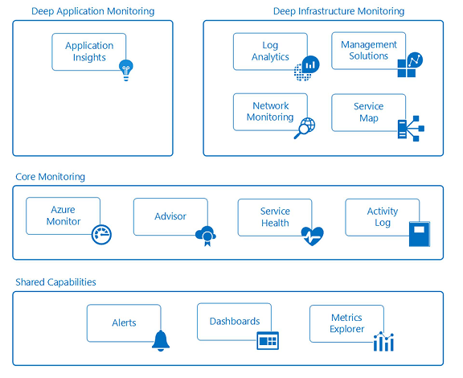

Monitoring
==========

Monitor and alerts
------------------

Collecting and analyzing telemetry that provides line of sight into the
activities, performance metrics, health and availability of the services you are
using across all of your Azure subscriptions is critical to proactively manage
your applications and infrastructure and is a foundational need of every Azure
subscription. Every Azure service emits telemetry in the form of Activity Logs,
Metrics and Diagnostic Logs.

-   **Activity Logs** describe all operations performed on resources in your
    subscriptions

-   **Metrics** are numerical information emitted from within a resource that
    describe the performance and health of a resource

-   **Diagnostic Logs** are emitted by an Azure service and provide rich,
    frequent data about the operation of that service.

This information can be viewed and acted upon at multiple levels and are
continually being improved. Azure provides **shared**, **core** and **deep**
monitoring capabilities of Azure resources through the services outlined in the
diagram below.

monitoring

monitoring

monitoring

monitoring

monitoring

monitoring

Shared capabilities
-------------------

-   **Alerts**: You can collect every log, event and metric from Azure
    resources, but without the ability to be notified of critical conditions and
    act, this data is only useful for historic purposes and forensics. Azure
    Alerts proactively notify you of conditions you define across all your
    applications and infrastructure. You create alert rules across logs, events
    and metrics that use action groups to notify sets of recipients. Action
    groups also provide the ability to automate remediation using external
    actions such as webhooks to run Azure Automation runbooks and Azure
    Functions.

-   **Dashboards**: Dashboards enable you to aggregate monitoring views and
    combine data across resources and subscriptions to give you an
    enterprise-wide view into the telemetry of Azure resources. You can create
    and configure your own views and share them with others. For example, you
    could create a dashboard consisting of various tiles for DBAs to provide
    information across all Azure database services, including Azure SQL DB,
    Azure DB for PostgreSQL and Azure DB for MySQL.

-   **Metrics Explorer**: Metrics are numerical values generated by Azure
    resources (e.g. % CPU, Disk I/O, that provide insight into the operation and
    performance of your resources. By using Metrics Explorer you can define and
    send the metrics in which you are interested to Log Analytics for
    aggregation and analysis.

Core monitoring
---------------

-   **Azure Monitor**: Azure Monitor is the core platform service that provides
    a single source for monitoring Azure resources. The Azure Portal interface
    of Azure Monitor provides a centralized jump off point for all the
    monitoring features across Azure including the deep monitoring capabilities
    of Application Insights, Log Analytics, Network Monitoring, Management
    Solutions and Service Maps. With Azure Monitor you can visualize, query,
    route, archive and act on the metrics and logs coming from Azure resources
    across your entire cloud estate. In addition to the portal you can retrieve
    data through the Monitor PowerShell Cmdlets, Cross Platform CLI or the Azure
    Monitor REST APIs.

-   **Azure Advisor**: Azure Advisor constantly monitors telemetry across your
    subscriptions and environments and provides recommendations on best
    practices on how to optimize your Azure resources to save money and improve
    performance, security and availability of the resources that make up your
    applications.

-   **Service Health**: Azure Service Health identifies any issues with Azure
    Services that may impact your applications as well as assists you in
    planning for scheduled maintenance windows.

-   **Activity Log**: The Activity Log describes all operations on resources in
    your subscriptions. It provides an audit trail to determine the 'what',
    'who', and 'when' of any create, update, delete operation on resources.
    Activity Log events are stored in the platform and are available to query
    for 90 days. You can ingest Activity Logs into Log Analytics for longer
    retention periods and deeper querying and analysis across multiple
    resources.

Deep application monitoring
---------------------------

-   **Application Insights**: Application Insights enables you to collect
    application specific telemetry and monitor the performance, availability and
    usage of applications in the cloud or on-premises. By instrumenting your
    application with supported SDKs for multiple languages including .NET,
    JavaScript, JAVA, Node.js, Ruby and Python. Application Insights events are
    ingested into the same Log Analytics data store that supports infrastructure
    and security monitoring to enable you to correlate and aggregate events over
    time through a rich query language.

Deep infrastructure monitoring
------------------------------

-   **Log Analytics**: Log Analytics plays a central role in Azure monitoring by
    collecting telemetry and other data from a variety of sources and providing
    a query language and analytics engine that gives you insights into the
    operation of your applications and resources. You can either interact
    directly with Log Analytics data through highly performant log searches and
    views, or you may use analysis tools in other Azure services that store
    their data in Log Analytics such as Application Insights or Azure Security
    Center.

-   **Network Monitoring**: Azure's network monitoring services enable you to
    gain insight into network traffic flow, performance, security, connectivity
    and bottlenecks. A well-planned network design should include configuring
    Azure network monitoring services such as Network Watcher and ExpressRoute
    Monitor.

-   **Management Solutions**: Management solutions are packaged sets of logic,
    insights and pre-defined Log Analytics queries for an application or
    service. They rely on Log Analytics as the foundation to store and analyze
    event data. Sample management solutions include monitoring containers and
    Azure SQL Database analytics.

-   **Service Map**: Service Map provides a graphical view into your
    infrastructure components, their processes and interdependencies on other
    computers and external processes. It integrates events, performance data and
    management solutions in Log Analytics.

[!TIP] Before creating individual alerts, create and maintain a set of shared
Action Groups that can be used across Azure Alerts. This will enable you to
centrally maintain the lifecycle of your recipient lists, notification delivery
methods (email, SMS phone numbers) and webhooks to external actions (Azure
Automation runbooks, Azure Functions / Logic Apps, ITSM).
